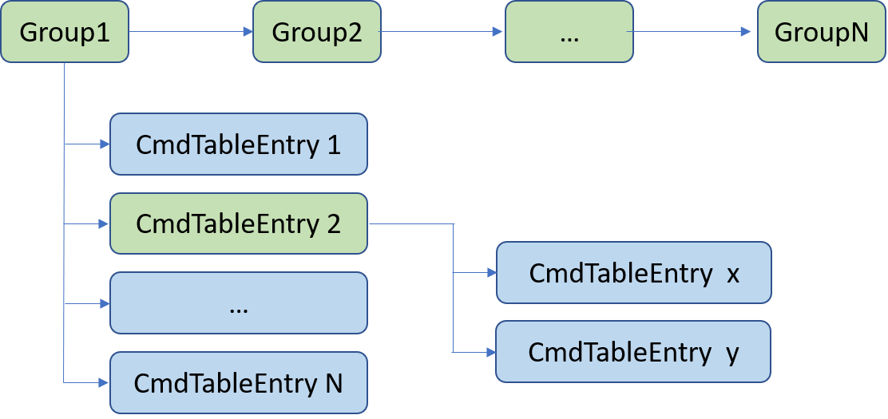

# Adding Custom CLI #


## Summary ##
In the RAIL examples, the definition of CLI commands is in the generated source file **autogen/sl_cli_command_table.c**. It's not convenient to add custom CLI commands by modifying this file as the changes might get lost after regenerate the project. This example demonstrates how we add custom CLI commands to the RAIL project. For more details about the CLI service, please refer to the following documents:
- [CLI Introduction](https://docs.silabs.com/gecko-platform/3.2/service/cli/overview)
- [CLI APIs Manual](https://docs.silabs.com/gecko-platform/3.2/service/api/group-cli)

The CLI elements are organized as a tree. The group nodes represent the branches and the command table entries represent the leaves. The CLI groups can be nested.
<div align="center">
    
</div>


## Gecko SDK version ##
Gecko SDK Suite v3.2

## Hardware Required ##
- EFR32FG12 2400/915 MHz 19 dBm Dual Band Radio Board (BRD4253A)

## Connections Required ##
NA

## Setup ##
1. Create a RAIL project based on the sample **Simple TRX**.
2. Modify the source file **app_cli.c**, add the following source code snippet to it.
   ```C
    #include "sl_cli_handles.h"

    void cmd_run_handler(sl_cli_command_arg_t *arguments)
    {
        int argc = sl_cli_get_argument_count(arguments);

        if (argc < 1) {
        printf("Not enough arguments. Expected 1! \n");
        return;
        }

        uint8_t enable = sl_cli_get_argument_uint8(arguments, 0);
        if (enable) {
        printf("To run \n");
        } else {
        printf("To stop \n");
        }
    }

    void cmd_custom_test_handler(sl_cli_command_arg_t *arguments)
    {
        int argc = sl_cli_get_argument_count(arguments);

        if (argc < 1) {
        printf("Not enough arguments. Expected 1! \n");
        return;
        }

        printf("user input=[%s] \n", sl_cli_get_argument_string(arguments, 0));
    }

    static const sl_cli_command_info_t custom_cmd_test =
        SL_CLI_COMMAND(cmd_custom_test_handler, "Custom test command",
                        "Input any string as the parameter",
                        {
                            SL_CLI_ARG_STRING,
                            SL_CLI_ARG_END,
                        });

    static sl_cli_command_entry_t custom_menu_entry[] = {
        {"test", &custom_cmd_test, false},
        {NULL, NULL, false},
    };

    static const sl_cli_command_info_t cmd_run =
        SL_CLI_COMMAND(cmd_run_handler, "Run command", "Argument 0:stop, 1:run",
                        {
                            SL_CLI_ARG_UINT8,
                            SL_CLI_ARG_END,
                        });

    static const sl_cli_command_info_t custom_cmd_menu =
        SL_CLI_COMMAND_GROUP(custom_menu_entry, "The custom command group");

    static sl_cli_command_entry_t custom_cmd_table[] = {
        {"run", &cmd_run, false},
        {"custom_menu", &custom_cmd_menu, false},
        {NULL, NULL, false},
    };

    static sl_cli_command_group_t custom_cmd_group = {
        {NULL},
        false,
        custom_cmd_table,
    };

    void cli_custom_cmd_init()
    {
        sl_cli_command_add_command_group(sl_cli_example_handle, &custom_cmd_group);
    }
   ```
3. Modify the source file **app_init.c**, invoke the function **cli_custom_cmd_init** in **app_init**.
4. Build and test.

## How It Works ##
1. Run the command **help** on the console, you should be able to see the command **run** and the command menu **custom_menu**.
   ```
    > help
    help
    run                           Run command
                                    [uint8] Argument 0:stop, 1:run
    custom_menu                   The custom command group
    info                          Unique ID of the MCU
    send                          Send a packet
    receive                       Turn ON/OFF received message forwarding on CLI
                                    [uint8] ON/OFF
    >   
   ```
2. Test the command **Run**:
   ```
    > run 0
    To stop 
    > run 1
    To run 
    >    
   ```
3. Test the command under the menu **custom_menu**:
    ```
    > custom_menu help
    test                          Custom test command
                                    [string] Input any string as the parameter
    > custom_menu test hello
    user input=[hello] 
    >     
    ```
## .sls Projects Used ##
- [rail_custom_cli_4253A.sls](SimplicityStudio/rail_custom_cli_4253A.sls)

## How to Port to Another Part ##
- Import the .sls file into Simplicity Studio
- Open the .slcp file of each project, turn to "Overview" tab, hit button "Change Target/SDK", then select the board and part.

## Special Notes ##
NA
