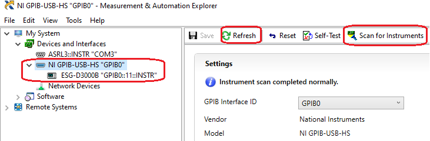
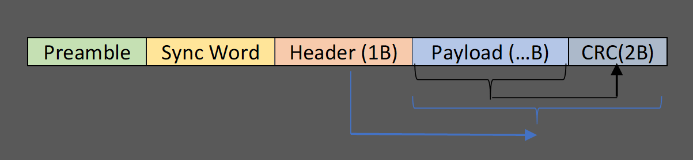

# How to Test Sensitivity of Long Range DSSS PHY on E4432B

## Overview

Silicon Labs provides a Long Range DSSS PHY to help customers to achieve the crucial design element of maximum effective range. The long range feature is described in [UG460](https://www.silabs.com/documents/public/user-guides/ug460-efr32-series-1-long-range-configuration.pdf).

The Long Range DSSS PHY is derived from the highly optimized IEEE 802.15.4 Zigbee PHY. Currently the detailed parameters of this PHY are not public and users can't customize it. To help customers test the sensitivity of their final Long Range products, we implement a tool to generate the ARB waveforms.

This article introduces the approach of testing the sensitivity of Silicon Labs Long Range PHY on Agilent E4432B, including the tool of generating the ARB waveform, the steps of setting the E4432B and how to do the PER test.

If you are using any other Signal Generator, or have further questions about this approach, please feel free to contact us through the [Silicon Labs support portal](https://community.silabs.com/s/support-home), thanks.

## Hardware Required

- Signal Generator E4432B.
- IEEE 488.2 GPIB to USB cable (One of the following).
  - [Agilent 82357B USB/GPIB Interface](https://www.keysight.com/hk/en/product/82357B/usb-gpib-interface-high-speed-usb-2-0.html)
  - [NI GPIB-USB-HS](https://www.ni.com/zh-cn/support/model.gpib-usb-hs.html)
- PC.
- DUT.

## Software Required

- IEEE 488.2 GPIB Driver (Install the driver according to your GPIB card provider).
  - [Agilent 82357B USB/GPIB Driver](https://www.keysight.com/hk/en/support/82357B/usb-gpib-interface-high-speed-usb-2-0.html#drivers)
  - [NI GPIB-USB-HS Driver](https://www.ni.com/zh-cn/support/downloads/drivers/download.ni-488-2.html#409630)
- [Silabs_LR_WaveformGenerator.exe](test/Silabs_LR_WaveformGenerator.exe) (Please make sure the GPIB driver is installed before running this tool).

## Connection

**Notes:**  

- Please use the GPIB driver to verify the GPIB connection. Assuming you are using the NI GPIB-USB-HS card, you can start the program **NI Max** to verify it.
  
- The serial port connection is used to run CLI commands on the DUT.

## How It Works

### Generate Waveform

1. Start the tool [Silabs_LR_WaveformGenerator.exe](test/Silabs_LR_WaveformGenerator.exe).
2. Fill the payload which you want to test. The header and CRC of the frame will be automatically updated. The long range PHY uses the IEEE 802.15.4 frame format, like below:
  
  **Notes**:
   - The byte order in the GUI of the tool is the same with the byte order of the packet over the air.
   - The long range PHY uses IEEE802.15.4 frame format. The maximum frame size is 127 bytes. As the CRC field takes 2 bytes, users can input maximum **125** bytes as the payload.
3. Fill the waveform file name. This is the waveform file name stored on the signal generator. The filename is **non-case-sensitive**.
4. Press the button “Generate” to generate the IQ data.
  
5. Click the button **Scan** to scan the connected E4432B, then click the **Download** button to download the generated waveform to the instrument. It takes about **~30-40** seconds to complete. The waveform file will be stored in the E4432B as a non-volatile file.

### Settings of the E4432B

1. On the signal generator keypad, press the **Mode** button and then select **Arb Waveform Generator | Dual Arb**.
2. Choose **Select Waveform**. If the ARB waveform list is empty, choose **Waveform Segments**.
3. Select **Load**, then use the wheel to navigate to the waveform file `LR_9K6`, then select **Load Segment From NVARB Memory**.
4. Press **Return**, navigate to the waveform file, then choose **Select Waveform**.
5. Press **Return**.
6. Select **Arb Setup**, and under **Arb Sample Clock**, input the sample clock with the keypad and then **Enter**. Press the **Return** button.  
   Here is how to calculate the sample clock. In the IQ waveform, each bit is represented by 16 points. The sample clock should be:

   `sample clock = data rate * spread factor * 16 / 2`

   For example, for `Long Range PHY DSSS 9.6kbps`, the spread factor is `8`, then the `sample clock` should be set to:

   `sample clock = 9.6 * 8 * 16 / 2 = 614.4 KHz`

   Where:
   - The number 9.6 is the data rate. The supported data rates include:
     - `1.2`
     - `2.4`
     - `4.8`
     - `9.6`
     - `19.2`
     - `80`
   - The number `16` in the equation is the IQ points for each bit. It's fixed in the tool.
   - Since we will split the data into I and Q, the result is divided by `2`.

   Below is the `sample clock` for the long range PHY with different data rates.

    Data Rate | Sample Clock
    ---------|----------
    1.2 kbps | 76.8 kHz
    2.4 kbps | 153.6 kHz
    4.8 kbps | 307.2 kHz
    9.6 kbps | 614.4 kHz
    19.2 kbps | 1228.8 kHz

7. Set the following:
   - `Arb Reference` -> `Int`
   - `Recon Filter` -> `8 MHz`
   - `Marker Pol` -> `Neg`
   - `Mkr2 to RF Blank` -> `On`

8. Press **Return** button.
9. Select `Trigger` -> `Single`.
10. Select **Trigger Set-up** and set the following:
    - `Trigger Source` -> `Ext`
    - `Ext Pol` -> `Neg`
    - `Ext Delay` -> `Off`
11. Verify that the displayed menu in the middle of the screen shows the following before continuing:
    - Sample Clock 614.4 KHZ
    - Reconstruction 8 MHz
    - Ref Freq 10 MHz (Int)
    - Trig Type Single
    - Trig Source Ext
    - Polarity Neg
    - Retrigger Off
    - Delay Off
12. Turn **Arb** On.

### Test

Please refer to section `4.2.3` of [AN972](https://www.silabs.com/documents/public/application-notes/an972-efr32-rf-eval-guide.pdf)  for details regarding testing steps.

The general steps are:  

1. Flash the Flex (RAIL) - RAILtest example project to the DUT.
2. On the console of the DUT, run the following command to start PER test.  

    `
    perrx 1000 10000
    `

   The first argument `1000` means to test 1000 packets.
   The second argument `10000` means to delay 10000 us between each packet.
   By running this command, the DUT will generate a pulse on the GPIO to trigger the Signal Generator to transmit a packet every 10000 us, total 1000 packets.
3. Use command `perstatus` or `status` to check the status.
4. Adjust the transmitting power of the E4432B and then repeat step 2 and step 3 until the PER reaches the tolerance.

## Video Guide

Here is a video about using the test.

https://user-images.githubusercontent.com/64514832/144957376-6e20390a-8bb6-4b96-96c4-9a79f5ac051f.mp4

## Test Report

A test based on the board `EFR32FG14 2400/490 MHz 19 dBm Radio Board with TCXO (SLWRB4261A)` was performed in a shielded room. The results were as follows:

### Test Result of the Long Range DSSS 1.2 kbps PHY

SG Tx Power | SG Tx Count | DUT Rx Count
---------|----------|---------
 -130.0 | 1000 | 934
 -129.5 | 1000 | 985
 -129.4 | 1000 | 994
 -129.4 | 5000 | 4955

 **Conclusion**: With PER tolerance set to 1%, the sensitivity is **-129.4 dbm**. The result is in agreement with the measured data in table 3-1 of [UG460](https://www.silabs.com/documents/public/user-guides/ug460-efr32-series-1-long-range-configuration.pdf). Note: The DUT uses a TCXO which improves the results.

### Test Result of the Long Range DSSS 9.6 kbps PHY

SG Tx Power | SG Tx Count | DUT Rx Count
---------|----------|---------
 -130.0 | 1000 | 0
 -125.0 | 1000 | 32
 -122.5 | 1000 | 781
 -121.3 | 1000 | 977
 -120.7 | 1000 | 986
 -120.6 | 1000 | 989
 -120.5 | 1000 | 991
 -120.5 | 5000 | 4970

 **Conclusion**: With PER tolerance set to 1%, the sensitivity is **-120.5 dbm**. The result is in agreement with the measured data in table 3-1 of [UG460](https://www.silabs.com/documents/public/user-guides/ug460-efr32-series-1-long-range-configuration.pdf) Note: The DUT uses a TCXO which improves the results.

## FAQ

### The tool Silabs_LR_WaveformGenerator.exe can't run?

The tool Silabs_LR_WaveformGenerator.exe has a dependency on GPIB driver. Please make sure the GPIB driver is installed.

### How to configure the trigger pin in RAILTEST?

On Simplicity Studio V5, open the `.slcp` file of the RAILtest project. Open the configuration of the component `RAILtest Application, Core` and select a GPIO as the trigger.

## References

- [KBA:Understanding DSSS Encoding and Decoding on EFR32 Devices](https://community.silabs.com/s/article/understanding-dsss-encoding-and-decoding-on-efr32-devices?language=en_US)
- [KBA:How to Download 802.15.4 Arbitrary Waveform Files to Agilent Signal Generator E4432B](https://community.silabs.com/s/article/how-to-download-802-15-4-arbitrary-waveform-files-to-agilent-signal-generator-e4?language=en_US)
- [KBA:How to Manually Set-up the Arb Waveform Generator for functional test](https://community.silabs.com/s/article/how-to-manually-set-up-the-arb-waveform-generator-for-functional-test?language=en_US)
- [Generation_of_IEEE_802154_Signals](https://scdn.rohde-schwarz.com/ur/pws/dl_downloads/dl_application/application_notes/1gp105/1GP105_1E_Generation_of_IEEE_802154_Signals.pdf)
- [E44xxB ESG Signal Generators SCPI Command Reference](https://www.keysight.com/hk/en/assets/9018-40176/programming-guides/9018-40176.pdf)
