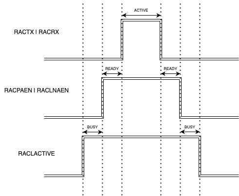

# RAIL Proprietary - State Transition Test #

## Overview ##

This project implements various radio state transition tests and measures the
time taken to transition between different states.

For detailed state transition test results, refer to [AN1392: Detailed Timing
Test Results for
RAIL](https://www.silabs.com/documents/public/application-notes/an1392-rail-timing-test.pdf).

## SDK Version ##

SiSDK 2024.06.02 and above

## Hardware Required ##

EFR32 Series 2

## Connections Required ##
 
Connect two Development Kits to your PC.

### Tested Boards for This Example ###

| Board ID | Description                                                                                                                                                                           |
|----------|---------------------------------------------------------------------------------------------------------------------------------------------------------------------------------------|
| BRD4182A | [EFR32xG22 2.4 GHz 6 dBm Radio Board](https://www.silabs.com/development-tools/wireless/slwrb4182a-efr32xg22-wireless-gecko-radio-board?tab=overview)                                 |
| BRD4204D | [EFR32ZG23 868-915 MHz 14 dBm Radio Board](https://www.silabs.com/development-tools/wireless/xg23-rb4204d-efr32xg23-868-915-mhz-14-dbm-radio-board?tab=overview)                      |
| BRD4186C | [EFR32xG24 2.4 GHz 10 dBm Radio Board](https://www.silabs.com/development-tools/wireless/xg24-rb4186c-efr32xg24-wireless-gecko-radio-board?tab=overview)                              |
| BRD4270B | [EFR32FG25 902-928 MHz 16 dBm Radio Board](https://www.silabs.com/development-tools/wireless/proprietary/fg25-rb4270b-efr32fg25-radio-board?tab=overview)                             |
| BRD4194A | [EFR32xG27 2.4 GHz 8 dBm Radio Board](https://www.silabs.com/development-tools/wireless/xg27-rb4194a-efr32xg27-8-dbm-wireless-radio-board?tab=overview)                               |
| BRD4401C | [EFR32xG28 868/915 MHz 20 dBm + 2.4 GHz 10 dBm Radio Board](https://www.silabs.com/development-tools/wireless/xg28-rb4401c-efr32xg28-2-4-ghz-ble-and-20-dbm-radio-board?tab=overview) |

## Setup ##

1. Generate the project using [Simplicity Studio
   v5](https://docs.silabs.com/simplicity-studio-5-users-guide/latest/ss-5-users-guide-about-the-launcher/welcome-and-device-tabs#example-projects-demos-tab)
   or [SLC
   CLI](https://docs.silabs.com/simplicity-studio-5-users-guide/latest/ss-5-users-guide-tools-slc-cli/).
2. Configure the necessary parameters as described in the
   [Configuration](#configuration) section.
3. Build and flash the project onto two boards.

## How It Works ##

This project performs various radio state transition tests and measures the time
taken for transitions. It utilizes radio PRS signals to indicate the current
radio state. Additionally, selected PRS signals are traced onto GPIO ports for
further analysis of state transitions.

The following table outlines the state transition scenarios available for
testing in each measurement mode:

| To \ From | Rx *(Tx needed)* | Rx                       | Tx                       | Idle                   |
|-----------|------------------|--------------------------|--------------------------|------------------------|
| Rx        | **RX_COMPLETE**  | **CHANNEL_SWITCH** *(M)* | **AUTO_TRANSITIONS**     | **MANUAL_TRANSITIONS** |
| Tx        | **RX_COMPLETE**  | **AUTO_TRANSITIONS**     | **CHANNEL_SWITCH** *(M)* | **MANUAL_TRANSITIONS** |
| Idle      | **RX_COMPLETE**  | **MANUAL_TRANSITIONS**   | **MANUAL_TRANSITIONS**   | N/A                    |

> *(Tx needed)*: This transition requires a transmitter node, and the state
> transition occurs automatically after packet reception completes. All other
> transitions from RX are initiated by calling `RAIL_Idle()`, `RAIL_StartTx()`
> or `RAIL_StartRx()`.

> *(M)*: This transition requires two defined channels.

Benchmarking scheduled operations falls outside the scope of this project.

----

The application can measure up to 16 different transition times. Where
applicable, it provides detailed timing information, including the duration
spent in the `BUSY` or `READY` states (or the combination of these states).
After completing the measurements, the application calculates statistical data
using `calc_statistics()`, which includes minimum, maximum, and average values,
and then outputs the results via `print_statistics()`.  

All scenarios repeat state transitions based on the
`SL_RAIL_STATE_TRANSITION_TEST_REPEAT_CYCLES` setting. Since each cycle's
results are stored in memory for statistical analysis, this setting is
constrained by available RAM. The minimum memory requirement is **8 × 4 ×
`SL_RAIL_STATE_TRANSITION_TEST_REPEAT_CYCLES`** bytes, as the application can
store up to 8 out of the 16 possible timing results per cycle in a
floating-point array (determined by `buffer_designation`).  

Automatic state transitions are controlled by `set_state_transitions`, while
`WAIT_FOR_RADIO_STATE` ensures the system waits until the desired state is
reached.  

----

A sample output of all scenarios, performed on EFR32xG25 using the default
configurations, is shown below:

```plaintext
[D] TIMER peripherals frequency: 78000000.00 us
[I] Current mode: MANUAL_TRANSITIONS
[I] Request to RX active (BUSY + READY): average: 58.00 us min: 57.92 us max: 62.37 us
[I] Request to LNA active (BUSY): average: 43.14 us min: 43.05 us max: 47.51 us
[I] RX active to idle (BUSY + READY): average: 22.68 us min: 22.65 us max: 22.71 us
[I] LNA active to idle (BUSY): average: 9.28 us min: 9.27 us max: 9.29 us
[I] Request to TX active (BUSY + READY): average: 121.88 us min: 121.83 us max: 121.92 us
[I] Request to PA active (BUSY): average: 76.64 us min: 76.59 us max: 76.68 us
[I] TX active to idle (BUSY + READY): average: 54.72 us min: 54.51 us max: 54.81 us
[I] PA active to idle (BUSY): average: 19.06 us min: 19.04 us max: 19.08 us
[I] Current mode: AUTO_TRANSITIONS
[I] LNA to PA (BUSY between): average: 70.97 us min: 70.94 us max: 71.01 us
[I] RX to TX (READY + BUSY between): average: 136.72 us min: 136.67 us max: 136.76 us
[I] PA to LNA (BUSY between): average: 35.97 us min: 35.88 us max: 36.28 us
[I] TX to RX (READY + BUSY between): average: 85.65 us min: 84.68 us max: 86.23 us
[I] Current mode: CHANNEL_SWITCH
[I] RX to RX primary to secondary (READY + BUSY between): average: 107.63 us min: 107.53 us max: 112.73 us
[I] RX to RX secondary to primary (READY + BUSY between): average: 107.14 us min: 107.09 us max: 107.18 us
[I] TX to TX primary to secondary: average (READY + BUSY between): 219.48 us min: 218.92 us max: 220.40 us
[I] TX to TX secondary to primary: average (READY + BUSY between): 219.06 us min: 218.77 us max: 219.67 us
[I] Current mode: RX_COMPLETE
[W] Transmitter node required!
[I] RX active to idle (BUSY + READY): average: 42.75 us min: 41.26 us max: 42.92 us
[I] RX to TX (BUSY + READY between): average: 130.24 us min: 128.26 us max: 129.35 us
[I] RX to RX (READY + BUSY between): average: 11.20 us min: 9.97 us max: 10.28 us
```

### Terminology of Radio States ###

| Description                                                    | State  | RAIL Terminology - RAC States (X\Y: X but not Y; \|: or) |
|----------------------------------------------------------------|--------|----------------------------------------------------------|
| Radio is active, but LNA/PA is not yet/no longer armed         | BUSY   | RACLACTIVE \ (RACLNAEN \| RACPAEN)                       |
| LNA/PA is armed, but de/modulation is not started or completed | READY  | (RACLNAEN \| RACPAEN) \ (RACTX \| RACRX)                 |
| De/modulation is in progress                                   | ACTIVE | RACTX \| RACRX                                           |

The following state transition diagram visually represents these states:



Note that during automatic state transitions between Rx ↔ Tx, the radio may not
need to leave the `BUSY` state. Similarly, during transitions between Rx ↔ Rx or
Tx ↔ Tx, the radio may remain in the `READY` state.  

### How to Use ###

This project is designed to be used as-is on development kits for evaluating
state transition times within your specific use case and radio configuration. It
can also serve as a valuable resource for training, providing insight into the
methodology for measuring and analyzing state transition times.

1. (Optional) Copy your radio configuration and modify configuration options in
   `sl_rail_state_transition_test_config.h` according your requirements.
2. Select the desired state transition scenario by pressing the **PB0** button.
   The selected scenario will be displayed on the console.
3. Press the **PB1** button to start the test. Transitions will repeat based on
   the `SL_RAIL_STATE_TRANSITION_TEST_REPEAT_CYCLES` setting.

## Configuration ##

The application uses the default USART/EUSART instance for console logging. The
VCOM enable signal is pre-configured for tested boards.

Additionally, the project utilizes:

- **9 PRS channels**
- **4 TIMER instances**
- **4 GPIO pins**

PRS channel and GPIO assignments are optimized for development kits but may
require adjustments for custom boards.

### Project-Specific Configurations ###

Additional settings are located in
`<project_root>/config/sl_rail_state_transition_test_config.h`. These
configurations are not available through the UI and must be edited manually.

#### `SL_RAIL_STATE_TRANSITION_TEST_TX_FIFO_SIZE` ####

Defines the TX FIFO size.

- Must be a power of 2 between 64 and 4096.
- [More
  info](https://docs.silabs.com/rail/latest/rail-api/efr32-main#receive-and-transmit-fifo-buffers).

#### `SL_RAIL_STATE_TRANSITION_TEST_BEST_EFFORT_TIMING` ####

Enables best-effort timing mode, setting state transitions to the shortest
possible time.

- [RAIL API
  Reference](https://docs.silabs.com/rail/latest/rail-api/rail-h#rail-set-state-timing).

#### `SL_RAIL_STATE_TRANSITION_TEST_ENABLE_SYNTH_CAL_CACHING` ####

Enables synthesizer calibration caching to optimize frequent channel changes.

- [RAIL API
  Reference](https://docs.silabs.com/rail/latest/rail-api/rail-h#rail-enable-cache-synth-cal).

#### `SL_RAIL_STATE_TRANSITION_TEST_BYPASS_CALIBRATIONS` ####

Disables automatic calibration routines between Rx/Tx transitions, which may
affect radio performance.

#### `SL_RAIL_STATE_TRANSITION_TEST_ENABLE_FAST_RX_2_RX` ####

Reduces Rx-to-Rx transition time but may impact reception quality.

- [RAIL API
  Reference](https://docs.silabs.com/rail/latest/rail-api/receive#rail-rx-option-fast-rx2-rx).

#### `SL_RAIL_STATE_TRANSITION_TEST_PTI_DISABLE` ####

Disables PTI trace output to reduce transition completion time.

- [RAIL API
  Reference](https://docs.silabs.com/rail/latest/rail-api/pti#rail-enable-pti).

#### `SL_RAIL_STATE_TRANSITION_TEST_REPEAT_CYCLES` ####

Defines the number of state transition cycles per measurement mode.

- Limited by available RAM.

#### `SL_RAIL_STATE_TRANSITION_TEST_PRIMARY_CHANNEL` ####

Sets the primary channel used for all measurement modes.

#### `SL_RAIL_STATE_TRANSITION_TEST_SECONDARY_CHANNEL` ####

Defines the secondary channel, required only for `CHANNEL_SWITCH` mode.

- Must be different from the primary channel.

#### `SL_RAIL_STATE_TRANSITION_TEST_IDLE_MODE` ####

Configures the idle mode used during state transition tests.

- [Idle Modes Training
  Material](https://docs.silabs.com/rail/latest/rail-training-idle/).

## Notes ##

- You can use a second node programmed with the same application to produce
  packets for `RX_COMPLETE` scenarios.
- The `doc` folder contains three logic analyzer captures illustrating the
  monitored PRS signals on EFR32xG22/23/24 generations for each scenario, except
  `RX_COMPLETE`.
- The default configuration is optimized for reducing the state transition
  times. However, for certain devices it may cause the `RX_COMPLETE` scenario to
  fail with no packets received.
- On certain radio platforms `RAIL_EnableCacheSynthCal()` may not be
  supported. In such cases, the application will print a warning message.
