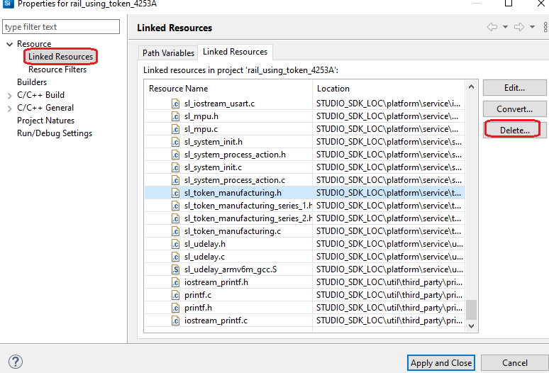
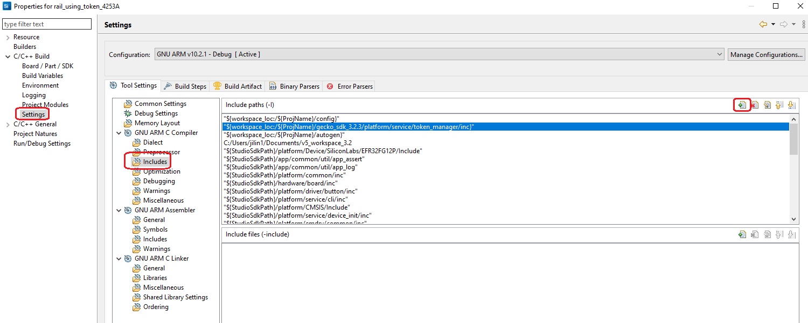

# RAIL Using Token on SDKv3.x #

## Summary ##
Sometimes, we need to store non-volatile data in RAIL applications, but unfortunately, there isn't a convenient way to achieve that just as we have the token system for Zigbee, Connect, etc. (For more details about the token, refer to [AN1154](https://www.silabs.com/documents/public/application-notes/an1154-tokens-for-non-volatile-storage.pdf)
)

Gecko SDK 3.x provides a component [**token manager**](https://docs.silabs.com/gecko-platform/3.2/service/api/group-token-manager#token-manager-intro) which can be used to implement the non-volatile data storage, but that's just used for Connect. This example demonstrates how we use token manager in a pure RAIL application.

## Gecko SDK version ##
Gecko SDK Suite v3.2

## Hardware Required ##
- EFR32FG12 2400/915 MHz 19 dBm Dual Band Radio Board (BRD4253A)

## Connections Required ##
NA

## Setup ##
1. Create a RAIL project based on **Simple_TRX**.
2. Install the component **Token Manager** and **Token Manager Test**.
3. Open the component **Token Manager**, turn on the option `Enable Custom Tokens`, for the field `File containing custom tokens`, leave it as the default value `sl_custom_token_header.h`.
4. Replace the header file **config/sl_custom_token_header.h** of your project with the one in this example [src/config/sl_custom_token_header.h](src/config/sl_custom_token_header.h).
5. Replace the folder **gecko_sdk_3.2.3/platform/service/token_manager** with the folder [src/token_manager](src/token_manager) in this example.
6. Modify the project properties to remove some linked source files, so that the local copy can be used. 
   
   Please remove the following items:
   - sl_token_def.c
   - sl_token_manager.c
7. Add an include item.
   
   Please add `"${workspace_loc:/${ProjName}/gecko_sdk_3.2.3/platform/service/token_manager/inc}"`
8. Modify the source file **app_cli.c**, add the following source code to it. In this file, we added some CLI commands to demonstrate how we read/write the basic, counter and indexed tokens.
   ```C
    #include "sl_cli_handles.h"
    #include "sl_token_manager.h"
    #include "string.h"

    void cmd_get_token_handler(sl_cli_command_arg_t *arguments)
    {
      if (0 == strcmp("basic", sl_cli_get_command_string(arguments, 1))) {
        uint16_t value;
        halCommonGetToken(&value, TOKEN_BASIC_DEMO);
        printf("The value of TOKEN_BASIC_DEMO is: 0x%04X \n", value);
      } else if (0 == strcmp("counter", sl_cli_get_command_string(arguments, 1))) {
        uint32_t value;
        halCommonGetToken(&value, TOKEN_COUNTER_DEMO);
        printf("The value of TOKEN_COUNTER_DEMO is: 0x%08lX \n", value);
      } else if (0 == strcmp("index", sl_cli_get_command_string(arguments, 1))) {
        uint8_t index;
        uint32_t value;

        if (sl_cli_get_argument_count(arguments) < 1) {
          printf("please input the index. \n");
          return;
        }

        index = sl_cli_get_argument_uint8(arguments, 0);
        halCommonGetIndexedToken(&value, TOKEN_INDEX_DEMO, index);
        printf("The value of TOKEN_INDEX_DEMO[%d] is: 0x%08lX \n", index, value);
      } else {
        //impossible branch
      }
    }

    void cmd_set_token_handler(sl_cli_command_arg_t *arguments)
    {
      if (0 == strcmp("basic", sl_cli_get_command_string(arguments, 1))) {
        uint16_t value;

        if (sl_cli_get_argument_count(arguments) < 1) {
          printf("please input the value. \n");
          return;
        }

        value = sl_cli_get_argument_uint16(arguments, 0);
        halCommonSetToken(TOKEN_BASIC_DEMO, &value);
        printf("Set the value of TOKEN_BASIC_DEMO to: 0x%04X \n", value);
      } else if (0 == strcmp("counter", sl_cli_get_command_string(arguments, 1))) {
        halCommonIncrementCounterToken(TOKEN_COUNTER_DEMO);
        printf("Increase the counter TOKEN_COUNTER_DEMO \n");
      } else if (0 == strcmp("index", sl_cli_get_command_string(arguments, 1))) {
        uint8_t index;
        uint32_t value;

        if (sl_cli_get_argument_count(arguments) < 2) {
          printf("please input the index and value. \n");
          return;
        }

        index = (uint8_t)sl_cli_get_argument_uint32(arguments, 0);
        value = sl_cli_get_argument_uint32(arguments, 1);
        halCommonSetIndexedToken(TOKEN_INDEX_DEMO, index, &value);
        printf("Set the value of TOKEN_INDEX_DEMO[%d] to: 0x%08lX \n", index, value);
      } else {
        //impossible branch
      }
    }

    void cmd_get_eui64_handler(sl_cli_command_arg_t *arguments)
    {
      uint8_t eui64[8] = {0};

      (void)arguments;

      halCommonGetMfgToken(eui64, TOKEN_MFG_CUSTOM_EUI_64);
      printf("TOKEN_MFG_CUSTOM_EUI_64:%02X%02X%02X%02X%02X%02X%02X%02X \n", eui64[7], eui64[6], eui64[5], eui64[4],
            eui64[3], eui64[2], eui64[1], eui64[0]);
    }

    void cmd_set_eui64_handler(sl_cli_command_arg_t *arguments)
    {
      uint8_t eui64[8] = {0};
      size_t len = 0;
      uint8_t *pdata;

      if (sl_cli_get_argument_count(arguments) < 1) {
        printf("please input the eui64. \n");
        return;
      }

      pdata = sl_cli_get_argument_hex(arguments, 0, &len);
      if (NULL != pdata && sizeof(eui64) == len) {
        eui64[7] = pdata[0];
        eui64[6] = pdata[1];
        eui64[5] = pdata[2];
        eui64[4] = pdata[3];
        eui64[3] = pdata[4];
        eui64[2] = pdata[5];
        eui64[1] = pdata[6];
        eui64[0] = pdata[7];

        //mfg token can be set only once
        int ret = halCommonSetMfgToken(TOKEN_MFG_CUSTOM_EUI_64, eui64);
        printf("set TOKEN_MFG_CUSTOM_EUI_64 ret=%d \n", ret);
      } else {
        printf("Input invalid \n");
      }
    }

    static const sl_cli_command_info_t cmd_token_get =
        SL_CLI_COMMAND(cmd_get_token_handler,
                      "Get token value",
                      "For index token, please input the index as well",
                      {
                          SL_CLI_ARG_UINT8OPT,
                          SL_CLI_ARG_END,
                      });

    static const sl_cli_command_info_t cmd_token_set =
        SL_CLI_COMMAND(cmd_set_token_handler,
                      "Set token value",
                      "for basic token, please input the value. No need for counter token",
                      {
                          SL_CLI_ARG_UINT32OPT,
                          SL_CLI_ARG_END,
                      });

    static const sl_cli_command_info_t cmd_indextoken_set =
        SL_CLI_COMMAND(cmd_set_token_handler,
                      "Set token value",
                      "For index token, the arg order is: <index> <value>",
                      {
                          SL_CLI_ARG_UINT32,
                          SL_CLI_ARG_UINT32,
                          SL_CLI_ARG_END,
                      });

    static sl_cli_command_entry_t cmd_token_oper_entry[] = {
        {"get", &cmd_token_get, false},
        {"set", &cmd_token_set, false},
    };

    static sl_cli_command_entry_t cmd_indextoken_oper_entry[] = {
        {"get", &cmd_token_get, false},
        {"set", &cmd_indextoken_set, false},
    };

    static const sl_cli_command_info_t cmd_indextoken_oper_menu =
        SL_CLI_COMMAND_GROUP(cmd_indextoken_oper_entry,
                            "The token operation(get/set) group");

    static const sl_cli_command_info_t cmd_token_oper_menu =
        SL_CLI_COMMAND_GROUP(cmd_token_oper_entry,
                            "The token operation(get/set) group");

    static sl_cli_command_entry_t cmd_token_submenu[] = {
        {"basic", &cmd_token_oper_menu, false},
        {"counter", &cmd_token_oper_menu, false},
        {"index", &cmd_indextoken_oper_menu, false},
        {NULL, NULL, false},
    };

    static const sl_cli_command_info_t cmd_eui64_get =
        SL_CLI_COMMAND(cmd_get_eui64_handler,
                      "Get eui64",
                      "No argument",
                      {
                          SL_CLI_ARG_END,
                      });

    static const sl_cli_command_info_t cmd_eui64_set =
        SL_CLI_COMMAND(cmd_set_eui64_handler,
                      "Set eui64",
                      "The Eui64 value. e.g. {0011223344556677}",
                      {
                          SL_CLI_ARG_HEX,
                          SL_CLI_ARG_END,
                      });

    static sl_cli_command_entry_t cmd_eui64_table[] = {
        {"get", &cmd_eui64_get, false},
        {"set", &cmd_eui64_set, false},
        {NULL, NULL, false},
    };

    static const sl_cli_command_info_t cmd_eui64_group =
        SL_CLI_COMMAND_GROUP(cmd_eui64_table,
                            "The eui64 command group");

    static const sl_cli_command_info_t cmd_token_menu =
        SL_CLI_COMMAND_GROUP(cmd_token_submenu,
                            "The token command group");

    static sl_cli_command_entry_t custom_cmd_table[] = {
        {"token", &cmd_token_menu, false},
        {"eui64", &cmd_eui64_group, false},
        {NULL, NULL, false},
    };

    static sl_cli_command_group_t custom_cmd_group = {
        {NULL},
        false,
        custom_cmd_table};

    void cli_custom_cmd_init()
    {
      sl_cli_command_add_command_group(sl_cli_example_handle, &custom_cmd_group);
    }
   ```
9.  Modify the source file **app_init.c**, in the function **app_init**, call the API **sl_token_init** to initialize the tokens. Then call the function **cli_custom_cmd_init** to initialize the custom CLI.
10. Build and test. 

## How It Works ##
1. In this example, there are instances defined for each token types (basic, counter and indexed). If more custom tokens need to be defined, just add them in the config file **config/sl_custom_token_header.h**. 
2. Run command **token basic get** to show the current value of the basic demo token and then use command **token basic set 1** to change it and verify the result.
   ```
    > Init token manager ret=0x0 
    Simple TRX
    > token basic get
    The value of TOKEN_BASIC_DEMO is: 0x0000 
    > token basic set 1
    Set the value of TOKEN_BASIC_DEMO to: 0x0001 
    > token basic get
    The value of TOKEN_BASIC_DEMO is: 0x0001 
    > Init token manager ret=0x0 
    Simple TRX
    > token basic get
    The value of TOKEN_BASIC_DEMO is: 0x0001 
    >    
   ```
3. Run command **token counter get** to show the current value of the counter demo token and then use command **token basic set** to increase it and verify the result.
   ```
    > Init token manager ret=0x0 
    Simple TRX
    > token counter get
    The value of TOKEN_COUNTER_DEMO is: 0x00000000 
    > token counter set
    Increase the counter TOKEN_COUNTER_DEMO 
    > token counter get
    The value of TOKEN_COUNTER_DEMO is: 0x00000001 
    > Init token manager ret=0x0 
    Simple TRX
    > token counter get
    The value of TOKEN_COUNTER_DEMO is: 0x00000001 
    >    
   ```
4. Run command **token index get 1** to show the current value of the counter demo token and then use command **token basic set 1 0x11223344** to change it and verify the result.
   ```
    > Init token manager ret=0x0 
    Simple TRX
    > token index get 1
    The value of TOKEN_INDEX_DEMO[1] is: 0x00000000 
    > token index set 1 0x11223344
    Set the value of TOKEN_INDEX_DEMO[1] to: 0x11223344 
    > token index get 1
    The value of TOKEN_INDEX_DEMO[1] is: 0x11223344 
    > Init token manager ret=0x0 
    Simple TRX
    > token index get 1
    The value of TOKEN_INDEX_DEMO[1] is: 0x11223344 
    >    
   ```
5. Run command **eui64 get** to read the MFG token **TOKEN_MFG_CUSTOM_EUI_64**, then use the command **eui64 set {1122334455667788}** to change it and verify the result. 
   
   **!!** **Pay attention**: **MFG token can only be written once**
   ```
    > Init token manager ret=0x0 
    Simple TRX
    > eui64 get
    TOKEN_MFG_CUSTOM_EUI_64:FFFFFFFFFFFFFFFF 
    > eui64 set {1122334455667788}
    set TOKEN_MFG_CUSTOM_EUI_64 ret=0 
    > eui64 get
    TOKEN_MFG_CUSTOM_EUI_64:1122334455667788 
    > Init token manager ret=0x0 
    Simple TRX
    > eui64 get
    TOKEN_MFG_CUSTOM_EUI_64:1122334455667788 
    >    
   ```

## .sls Projects Used ##
- [rail_using_token_4253A.sls](SimplicityStudio/rail_using_token_4253A.sls)

## How to Port to Another Part ##
- Import the .sls file into Simplicity Studio
- Open the .isc file of each project, turn to "General" tab, hit button "Edit Architecture", then select the board and part.

## Special Notes ##
NA
