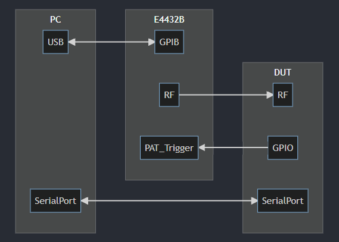
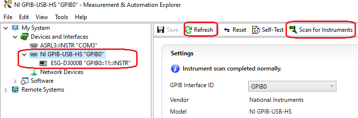
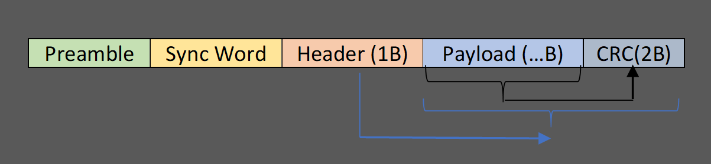
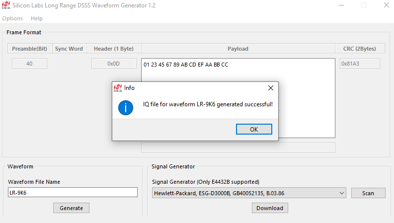
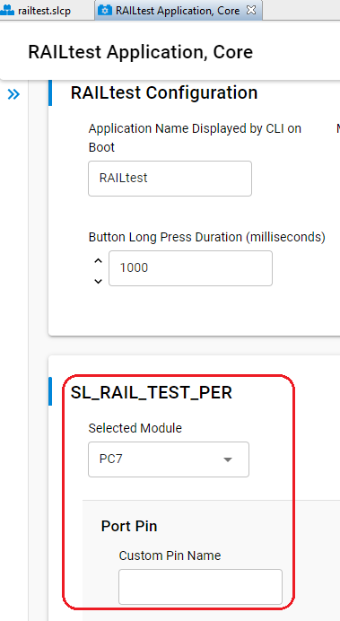

# How to Test the Sensitivity of the Long Range DSSS PHY Using an E4432B

## Overview

Silicon Labs provides a Long Range DSSS PHY to help customers maximize effective range. The Long Range feature is described in [docs.silabs.com](https://docs.silabs.com/rail/latest/efr32-series-1-long-range-configuration/).

The Long Range DSSS PHY is derived from the IEEE 802.15.4 Zigbee PHY. The detailed PHY parameters are not public, and the configuration is not user-configurable. To support sensitivity testing of Long Range products, Silicon Labs provides a tool that generates ARB (arbitrary) waveforms.

This document describes an approach for testing the sensitivity of the Silicon Labs Long Range PHY for Series 1 devices using an Agilent E4432B. It covers waveform generation, E4432B configuration, and how to run a PER (packet error rate) test.

If you are using a different signal generator, or if you have questions about this approach, contact Silicon Labs through the [support portal](https://community.silabs.com/s/support-home).

## Hardware Required

- Signal generator: E4432B
- IEEE 488.2 GPIB to USB cable (one of the following)
  - [Agilent 82357B USB/GPIB Interface](https://www.keysight.com/hk/en/product/82357B/usb-gpib-interface-high-speed-usb-2-0.html)
  - [NI GPIB-USB-HS](https://www.ni.com/zh-cn/support/model.gpib-usb-hs.html)
- PC
- Series 1 DUT (Device Under Test)

## Software Required

- IEEE 488.2 (GPIB) driver (install the driver provided by your GPIB interface vendor).
  - [Agilent 82357B USB/GPIB Driver](https://www.keysight.com/hk/en/support/82357B/usb-gpib-interface-high-speed-usb-2-0.html#drivers)
  - [NI GPIB-USB-HS Driver](https://www.ni.com/zh-cn/support/downloads/drivers/download.ni-488-2.html#409630)
- [Silabs_LR_WaveformGenerator.exe](Silabs_LR_WaveformGenerator.exe) (install the GPIB driver before running this tool).

## Connection



**Notes:**

- Use the GPIB driver to verify the GPIB connection. If you are using the NI GPIB-USB-HS interface, you can use **NI MAX** to verify the connection.

  

- Use the serial port connection to run CLI commands on the DUT.

## How It Works

### Generate Waveform

1. Start the tool [Silabs_LR_WaveformGenerator.exe](Silabs_LR_WaveformGenerator.exe).
2. Enter the payload you want to test. The tool automatically updates the frame header and CRC. The Long Range PHY uses the IEEE 802.15.4 frame format:

   

   **Notes:**
   - The byte order shown in the GUI matches the byte order transmitted over the air.
   - The maximum IEEE 802.15.4 frame size is 127 bytes. Because the CRC field is 2 bytes, you can enter up to **125** payload bytes.
3. Enter the waveform file name. This is the waveform filename stored on the signal generator. The filename is **not case-sensitive**.
4. Click **Generate** to generate the IQ data.

   

5. Click **Scan** to detect the connected E4432B, then click **Download** to transfer the generated waveform to the instrument. This typically takes **~30–40** seconds. The waveform is stored on the E4432B as a non-volatile file.

### E4432B Settings

Calculate the ARB sample clock as follows. In the IQ waveform, each bit is represented by 16 points. Use:

`sample clock = data rate * spread factor * 16 / 2`

For example, for **Long Range PHY DSSS 9.6 kbps**, the spread factor is `8`, so:

`sample clock = 9.6 * 8 * 16 / 2 = 614.4 kHz`

Where `9.6` is the data rate (kbps) and `16` is the number of IQ points per bit (fixed by the tool). The data is split into I and Q, so the result is divided by `2`.

Sample clock values for common Long Range data rates:

| Data Rate | Sample Clock |
| --------- | ------------ |
| 1.2 kbps  | 76.8 kHz     |
| 2.4 kbps  | 153.6 kHz    |
| 4.8 kbps  | 307.2 kHz    |
| 9.6 kbps  | 614.4 kHz    |
| 19.2 kbps | 1228.8 kHz   |

1. On the signal generator keypad, press the **Mode** button and then select **Arb Waveform Generator | Dual Arb**.
2. Choose **Select Waveform**. If the ARB waveform list is empty, choose **Waveform Segments**.
3. Select **Load**, use the wheel to navigate to the waveform file `LR_9K6`, then select **Load Segment From NVARB Memory**.
4. Press **Return**, navigate to the waveform file, then choose **Select Waveform**.
5. Press **Return**.
6. Select **Arb Setup**, and under **Arb Sample Clock**, enter the sample clock using the keypad, then press **Enter**. Press **Return**.
7. Set the following:
   - `Arb Reference` -> `Int`
   - `Recon Filter` -> `8 MHz`
   - `Marker Pol` -> `Neg`
   - `Mkr2 to RF Blank` -> `On`
8. Press **Return**.
9. Select `Trigger` -> `Single`.
10. Select **Trigger Set-up** and set the following:
    - `Trigger Source` -> `Ext`
    - `Ext Pol` -> `Neg`
    - `Ext Delay` -> `Off`
11. Verify that the displayed menu in the middle of the screen shows the following before continuing:
    - Sample Clock 614.4 kHz
    - Reconstruction 8 MHz
    - Ref Freq 10 MHz (Int)
    - Trig Type Single
    - Trig Source Ext
    - Polarity Neg
    - Retrigger Off
    - Delay Off
12. Turn **Arb** On.

### Test

Refer to section `4.2.3` of [AN972](https://docs.silabs.com/rail/latest/efr32-rf-eval-guide/) for detailed test steps.

The general steps are:

1. Flash the `RAIL SoC - RAILtest` example project to the DUT.
2. On the DUT console, run the following command to start the PER test.

```
perrx 1000 10000
```

- The first argument `1000` means to test 1000 packets.
- The second argument `10000` means to delay 10000 us between packets.
  
When you run this command, the DUT generates a pulse on the selected GPIO to trigger the signal generator to transmit one packet every 10000 us, for a total of 1000 packets.

3. Use the `perstatus` or `status` command to check the status.
4. Adjust the E4432B output power, then repeat steps 2 and 3 until the PER reaches your tolerance.

## Video Guide

Video walkthrough:

https://user-images.githubusercontent.com/64514832/144957376-6e20390a-8bb6-4b96-96c4-9a79f5ac051f.mp4

## Test Report

A test using `EFR32FG14 2400/490 MHz 19 dBm Radio Board with TCXO (SLWRB4261A)` was performed in a shielded room. The results were as follows:

### Test Result of the Long Range DSSS 1.2 kbps PHY

| SG Tx Power | SG Tx Count | DUT Rx Count |
| ----------- | ----------- | ------------ |
| -130.0      | 1000        | 934          |
| -129.5      | 1000        | 985          |
| -129.4      | 1000        | 994          |
| -129.4      | 5000        | 4955         |

### Test Result of the Long Range DSSS 9.6 kbps PHY

| SG Tx Power | SG Tx Count | DUT Rx Count |
| ----------- | ----------- | ------------ |
| -130.0      | 1000        | 0            |
| -125.0      | 1000        | 32           |
| -122.5      | 1000        | 781          |
| -121.3      | 1000        | 977          |
| -120.7      | 1000        | 986          |
| -120.6      | 1000        | 989          |
| -120.5      | 1000        | 991          |
| -120.5      | 5000        | 4970         |

**Conclusion**: With PER tolerance set to 1%, the sensitivity results agree with the measured data in [this table](https://docs.silabs.com/rail/latest/efr32-series-1-long-range-configuration/04-measured-performance-of-the-long-range-phys#conducted-testing). Note: The DUT uses a TCXO, which improves the results.

## FAQ

### The tool Silabs_LR_WaveformGenerator.exe won't run

The tool `Silabs_LR_WaveformGenerator.exe` depends on the GPIB driver. Make sure the GPIB driver is installed.

### How to configure the trigger pin in RAILtest?

In the RAILtest project, open the configuration for the `RAILtest Application, Core` component and select a GPIO as the trigger.



## References

- [Understanding DSSS Encoding and Decoding on EFR32 Devices](https://community.silabs.com/s/article/understanding-dsss-encoding-and-decoding-on-efr32-devices?language=en_US)
- [How to Download 802.15.4 Arbitrary Waveform Files to Agilent Signal Generator E4432B](https://community.silabs.com/s/article/how-to-download-802-15-4-arbitrary-waveform-files-to-agilent-signal-generator-e4?language=en_US)
- [How to Manually Set-up the Arb Waveform Generator for functional test](https://community.silabs.com/s/article/how-to-manually-set-up-the-arb-waveform-generator-for-functional-test?language=en_US)
- [Generation_of_IEEE_802154_Signals](https://scdn.rohde-schwarz.com/ur/pws/dl_downloads/dl_application/application_notes/1gp105/1GP105_1E_Generation_of_IEEE_802154_Signals.pdf)
- [E44xxB ESG Signal Generators SCPI Command Reference](https://www.keysight.com/hk/en/assets/9018-40176/programming-guides/9018-40176.pdf)
